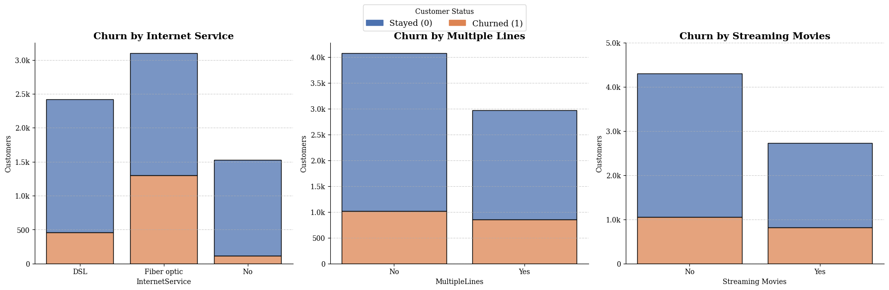

# Telco Customer Churn Prediction & Business Insights

##  The Business Problem
A telecommunications company is experiencing a high rate of customer churn (customers leaving for competitors). The goal of this project is to analyze customer data, identify the key drivers of churn, and build a predictive model to flag at-risk customers, allowing the business to take proactive retention measures.

##  Technologies Used
* **Database:** SQLite / SQL
* **Data Processing & EDA:** Python (Pandas, NumPy)
* **Data Visualization:** Matplotlib, Seaborn
* **Statistical Diagnostics:** Statsmodels (VIF)
* **Machine Learning:** Scikit-Learn (Logistic Regression)

##  Methodology & Approach
Unlike basic predictive pipelines, this project focuses heavily on **model interpretability and statistical validity**:
1. **Data Preprocessing:** Handled missing values and performed One-Hot Encoding for categorical variables.
2. **Handling Class Imbalance:** Addressed the heavily imbalanced dataset (high retention, low churn) by applying algorithmic class weights (`class_weight='balanced'`). This significantly boosted the **Recall** metric, ensuring the model successfully catches customers who are actually going to leave.
3. **Multicollinearity Diagnostic (VIF):** Conducted a Variance Inflation Factor (VIF) analysis to eliminate multicollinearity (e.g., removing `TotalCharges` and redundant dummy variables). This crucial step ensured that the Logistic Regression coefficients were mathematically stable and ready for business interpretation.

##  Business Insights: Why are customers leaving?
By extracting the weights from the statistically robust Logistic Regression model, we identified the top drivers of customer behavior:

**Top 3 Churn Drivers (Risk Factors):**
1. **Fiber Optic Service:** The strongest indicator of churn. This suggests potential technical issues, outages, or unmet expectations with the premium internet service.
2. **Multiple Lines (No Phone Service):** Customers with specific, non-standard line configurations show a higher propensity to leave.
3. **Streaming Movies:** Customers subscribing to movie streaming are churning faster, hinting at poor platform content or fierce external competition (e.g., Netflix).

**Top Retention Drivers (Loyalty Factors):**
1. **Long-Term Contracts:** 1-year and 2-year contracts are the absolute strongest retention mechanics.
2. **Tenure:** The longer a customer stays, the less likely they are to churn. 
3. **No Internet Service:** A specific demographic (likely older customers relying only on landlines) remains highly loyal and unaffected by market competition.

##  Dashboard & Visualizations
Below is a snapshot of the custom dashboard built to visualize the risk of churn across different service categories.

## How to Run
1. Clone this repository.
2. Install dependencies: `pip install -r requirements.txt`
3. Run the main notebook/script to view the data cleaning, VIF diagnostics, model training, and visualization outputs.