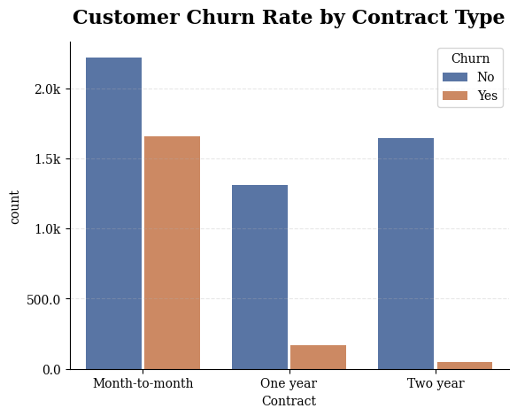

# Telco Customer Churn Prediction & Business Insights

## The Business Problem
A telecommunications company is experiencing a high rate of customer churn (customers leaving for competitors). The goal of this project is to identify the key drivers associated with churn and build a model that flags at-risk customers, so the business can target retention efforts where they matter most.

## Technologies Used
* **Database:** SQLite / SQL
* **Data Processing & EDA:** Python (Pandas, NumPy)
* **Visualization:** Matplotlib, Seaborn
* **Statistical Diagnostics:** Statsmodels (VIF)
* **Machine Learning:** Scikit-Learn (Logistic Regression)

## Methodology & Approach
This project prioritizes **model interpretability and statistical validity** over raw accuracy — the aim is a model whose coefficients can actually be trusted as business signals.

1. **Data cleaning.** Converted `TotalCharges` to numeric, isolating 11 new customers (tenure = 0) with blank values and handling them explicitly.

2. **Detecting and fixing structural multicollinearity.** Several categorical columns carried levels that were *structurally redundant* with a parent column — e.g. `MultipleLines = "No phone service"` is fully determined by `PhoneService = No`, and six internet add-on columns carried a `"No internet service"` level fully determined by `InternetService = No`. Left in place, one-hot encoding turned these into dummy columns **perfectly collinear** with their parent. I confirmed this with cross-tabulations and a Variance Inflation Factor (VIF) analysis (these columns returned infinite VIF), then **collapsed the redundant levels before encoding** so the problem was removed at the source rather than patched afterward.

3. **Residual economic collinearity.** After the structural fix, `MonthlyCharges` still showed very high VIF (~177) because it is close to a linear combination of the service dummies (more services → higher bill). Rather than discard price entirely, I kept it for predictive value but **treat its coefficient — and other high-VIF coefficients — as non-interpretable**, reading business meaning only from low-VIF features.

4. **Class imbalance.** The dataset is imbalanced (~73% retained, ~27% churned). I applied `class_weight='balanced'` to prioritize catching churners.

## Model Performance
Logistic Regression, evaluated on a held-out test set (n = 1,409):

| Metric (churn class) | Score |
|---|---|
| Recall | **0.82** |
| Precision | 0.52 |
| Accuracy (overall) | 0.76 |

The model catches **82% of customers who actually churn**, at the cost of precision — when it flags a customer, it is right about half the time. This trade-off is deliberate. In churn, the costs are asymmetric: missing a real churner (lost customer) is more expensive than a false alarm (a retention offer to someone who would have stayed). The model is tuned to miss as few real churners as possible.

## Business Insights: what's associated with churn?
Reading only the **low-VIF, statistically stable** coefficients (associations, not proven causes):

**Strongest retention signal — contract length.**
* `Two-year contract` is the single strongest signal in the model (weight −1.47), with `one-year contract` close behind (−0.68). Longer commitments are strongly associated with staying; month-to-month customers are the clear flight risk. This is the headline, actionable finding — and it sits on trustworthy, low-collinearity features.
* Longer **tenure** is likewise associated with lower churn.

**Churn-associated signals (interpret with care):**
* `Fiber optic` carries the largest positive weight (+1.00), i.e. fiber customers churn more. **Caveat:** fiber is collinear with high monthly cost (VIF ~13), so this likely reflects *higher-priced customers leaving* rather than fiber itself — the two can't be cleanly separated here.
* `Electronic check` payment is associated with higher churn.

## Limitations
* High economic collinearity between `MonthlyCharges` and the service columns means individual cost/service coefficients are not independently interpretable; only the low-VIF signals above are read as findings.
* The recall/precision trade-off is a deliberate business choice, not an optimum — the right balance depends on the actual cost of a retention offer vs. a lost customer.
* Coefficients describe **associations** in this dataset, not causal effects.

## Dashboard & Visualizations

## How to Run
1. Clone this repository.
2. Install dependencies: `pip install -r requirements.txt`
3. Run `eda.py` to reproduce the cleaning, VIF diagnostics, model training, and plots.